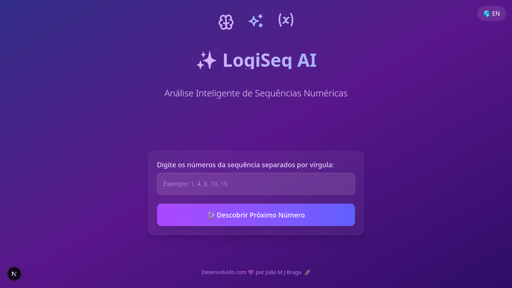

  <h1 style="color: #4da3ff; font-size: 3.5rem;"> LogiSeq</h1>
  
<strong>Descubra o próximo número em qualquer sequência lógica usando algoritmos matemáticos</strong>

  
    
  

---

## 🚀 Sobre o projeto

**LogiSeq** é uma aplicação web que identifica padrões em sequências numéricas e prevê o próximo número utilizando o método de diferenças sucessivas.

---

## ⚙️ Funcionalidades

- ✅ Inserção de sequência numérica (separada por vírgulas)
- 🔁 Cálculo automático do próximo número
- 🌗 Tema claro/escuro (baseado na preferência do sistema)
- 📱 Interface responsiva e intuitiva

---

## 🧠 Como funciona

O algoritmo baseia-se em **diferenças sucessivas**:

1. Calcula as diferenças entre os números consecutivos.
2. Continua o processo até que as diferenças se tornem constantes.
3. Usa esse padrão para prever o próximo número da sequência original.

> Exemplo:  
> Entrada: `2, 4, 8, 14, 22`  
> Saída: `32`

---

## 🛠️ Tecnologias utilizadas

- [Next.js](https://nextjs.org/)
- [React](https://reactjs.org/)
- [TypeScript](https://www.typescriptlang.org/)
- [CSS Modules](https://github.com/css-modules/css-modules)
---

## 🧪 Teste agora

Acesse a aplicação:

👉 [https://logiseq.vercel.app](https://logiseq.vercel.app)

---

## 📄 Licença

Este projeto está licenciado sob a licença MIT.  
Consulte o arquivo [LICENSE](LICENSE) para mais detalhes.

---

  <strong>Feito com 💙 por <a href="https://github.com/joaomjbraga">João Marcos Braga</a></strong>

